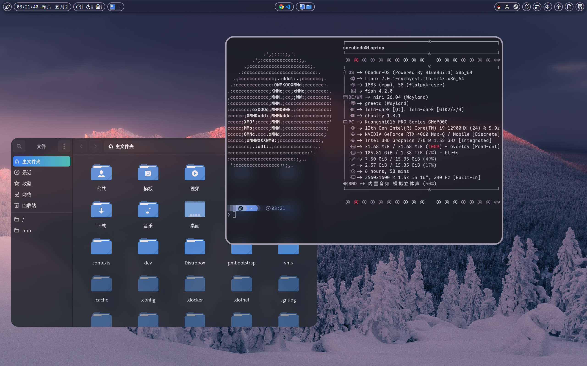
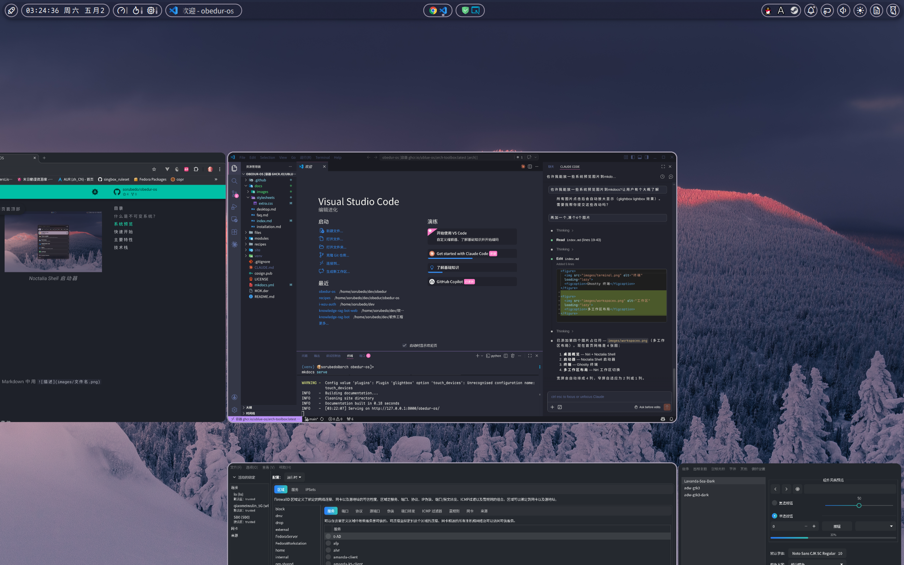

# 欢迎使用 Obedur-OS

Obedur-OS 是基于 [BlueBuild](https://blue-build.org/) 构建的 Fedora Atomic 不可变系统镜像，提供开箱即用的 Niri 滚动平铺 Wayland 桌面环境。

> 本系统使用 CachyOS LTO 优化内核，较为激进，要求 CPU 支持 **x86_64-v3** 指令集（Intel Haswell / AMD Excavator 及更新架构）。

## 什么是不可变系统？

与传统的 Linux 发行版不同，Obedur-OS 采用**不可变基础设施**理念：

- 系统核心以只读方式挂载，防止意外修改和恶意篡改
- 系统更新以原子化方式进行——要么全部成功，要么完全不生效
- 每次更新自动保留前一个版本，出问题可立即回滚
- 所有应用推荐通过 Flatpak 或容器运行，与系统层解耦

简单来说：**系统更稳定、更新更安全、回滚更简单。**

## 系统预览

<figure>
  
  <figcaption>Niri + Noctalia Shell 桌面概览</figcaption>
</figure>

<figure>
  
  <figcaption>Noctalia Shell 启动器</figcaption>
</figure>

<figure>
  
  <figcaption>Ghostty 终端</figcaption>
</figure>

<figure>
  
  <figcaption>多工作区布局</figcaption>
</figure>

## 快速开始

1. [选择镜像](installation.md#_2) — 根据显卡硬件选择合适的变体
2. [安装系统](installation.md) — 通过 bootc 或 rpm-ostree 变基
3. [桌面操作](desktop.md) — 了解 Niri 的键位操作和布局概念

## 主要特性

| 特性 | 说明 |
| :--- | :--- |
| **不可变系统** | Fedora Atomic (Ostree Native Container)，系统只读，更新原子化，一键回滚 |
| **Niri 滚动平铺** | 横向无限平铺 + 纵向工作区，配合 [Noctalia Shell](https://docs.noctalia.dev/) 精美桌面 |
| **CachyOS 内核** | 全版本集成 CachyOS LTO 优化内核 |
| **SecureBoot** | 内核模块签名 + MOK 首次启动自动注册 |
| **容器化工作流** | 预装 podman-compose、podlet、distrobox |
| **自动构建签名** | GitHub Actions 每日构建，cosign 签名验证 |

## 系统组件

| 组件 | 选择 |
| :--- | :--- |
| 基础系统 | Fedora Atomic 43 |
| 构建框架 | BlueBuild |
| Wayland 合成器 | [Niri](https://github.com/YaLTeR/niri)（滚动平铺） |
| 桌面 Shell | [Noctalia Shell](https://docs.noctalia.dev/)（基于 quickshell） |
| 登录管理 | greetd + tuigreet |
| 终端 | [Ghostty](https://ghostty.org/) |
| 输入法 | fcitx5 |
| 无线网络 | NetworkManager（iwd 作为 WiFi 后端） |
| 容器 | Podman + Distrobox |
